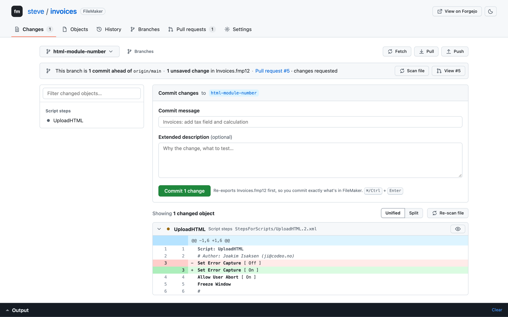
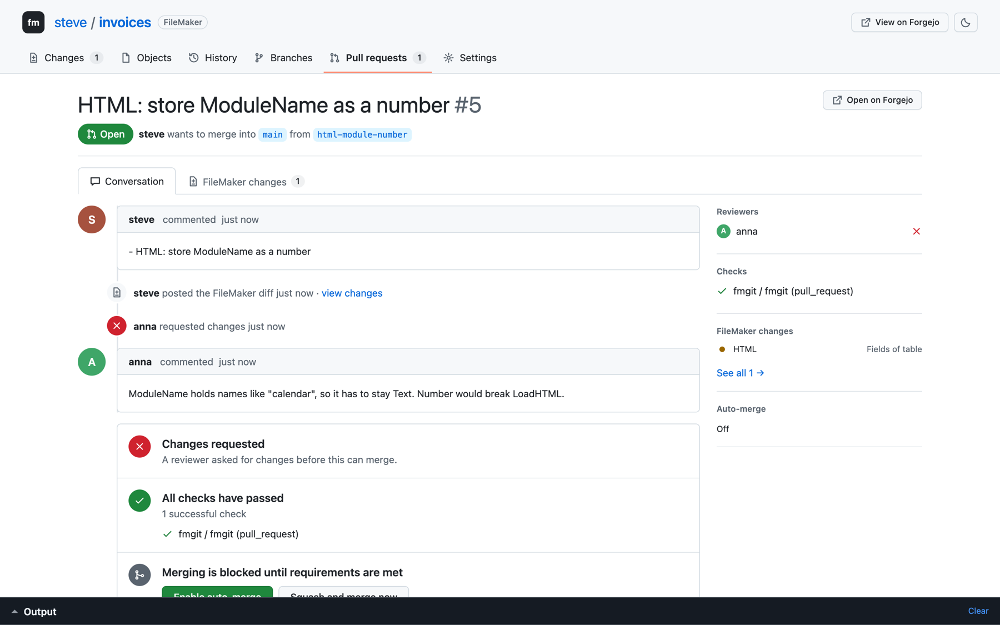
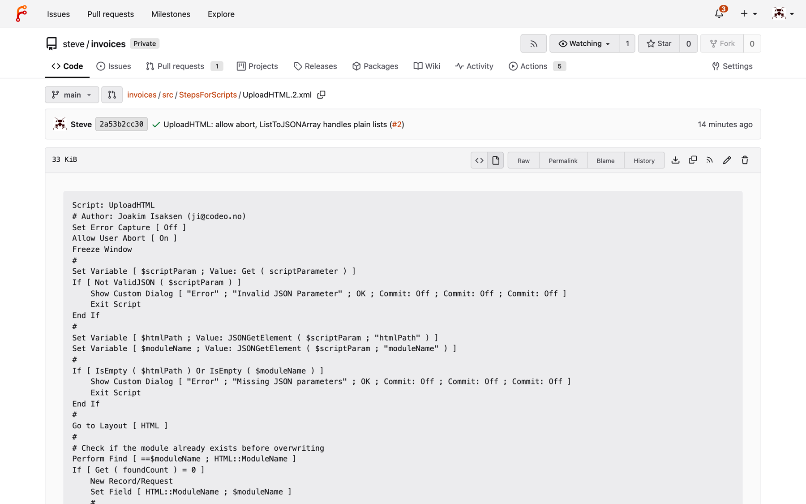

# fmgit: git for FileMaker

Branches, diffs, pull requests, approvals and auto-merge for FileMaker solutions,
using git and GitHub (or any git host).

A `.fmp12` is a binary, so git can't diff or merge it. fmgit exports it to **one
XML file per FileMaker object** (script, script steps, table, fields, layout,
custom function, value list, ...). Two developers can change the same solution
in parallel, and git merges their work object by object. After a merge, fmgit
turns the changes back into an **FMUpgradeTool patch** and applies it to your
local file.

```
 your App.fmp12 ──fmgit save──▶ src/ScriptCatalog/Create Invoice.12.xml ──fmgit pr──▶ GitHub PR
       ▲                         src/StepsForScripts/Create Invoice.12.xml             │ review + CI check
       └──────fmgit pull◀── FMUpgradeTool patch ◀── merged main ◀──── auto-merge ◀─────┘
```

## Documentation

Full documentation lives in [`docs/`](docs/), built with
[VitePress](https://vitepress.dev): guide, web UI tour, hosting on Forgejo or
GitHub, CLI and configuration reference, troubleshooting.

```sh
cd docs && npm install && npm run dev     # http://localhost:5173
```

`.github/workflows/docs.yml` publishes it to GitHub Pages on every push to
`main` that touches `docs/`.

**Putting everything online** (fmgit releases, docs, a Forgejo team server
with HTTPS and CI) is described step by step in
[`docs/hosting/going-online.md`](docs/hosting/going-online.md).

## Web UI

```sh
fmgit ui
```

The local half of the workflow, in a GitHub-style browser UI. It's built into
the same binary and works offline on macOS, Windows and Linux.



- **Changes:** GitHub's "Files changed" for your unsaved FileMaker work. Script
  changes show as script text. Commit from the box on top.
- **Objects:** a code browser for the solution. Folders per catalog, scripts
  syntax-highlighted, tables with their fields, last commit and history per
  object. Press `/` to search names or every calculation and script.
- **History, Branches:** commit history grouped by day, commit pages with
  stacked diffs, and branches with how far each is ahead of or behind main.
- **Pull requests:** conversation, reviews, checks, merge box, review form, and
  a "FileMaker changes" tab with readable diffs. Works with GitHub and Forgejo.
- **Settings:** `fmgit.json`, session-only credentials, consistency check,
  branch protection, deploy patches.
- **Status bar:** "This branch is 2 commits ahead of origin/main · Invoices.fmp12
  is in sync". It shows whether your **.fmp12** is current and offers the next
  step: Scan, Apply, Push, Open pull request.



The server listens on `127.0.0.1` only. Every request needs the random token
from the link `fmgit ui` prints, so other websites can't drive it. Commands run
through the same `fmgit` code as the CLI, with the same safety rails.

## Hosting: Forgejo (self-hosted) or GitHub

fmgit doesn't ship its own server. It plugs into a real forge:

- **[Forgejo](https://forgejo.org)** (or Gitea): free and self-hosted, one
  binary or one Docker container. Recommended if FileMaker code shouldn't
  leave your network.
- **GitHub:** via the `gh` CLI.

The forge is detected from `origin`. For Forgejo, set a token
(`export FMGIT_FORGE_TOKEN=...`, created under *Settings › Applications* with
repository + issue read/write), or paste it in the UI's Settings.

What you get on Forgejo, with no plugin and no fork:

| | How |
|---|---|
| Pull requests, reviews, required approvals | `fmgit pr`, `approve`, `reject`, or the UI |
| Auto-merge when approved + green | `fmgit pr` arms it (`merge_when_checks_succeed`) |
| Protected main, no direct pushes | `fmgit protect` |
| FileMaker check + readable diff comment on every PR | `.forgejo/workflows/fmgit.yml` (written by `fmgit init`, same file as the GitHub one) |
| Readable scripts and fields in Forgejo's own file browser | external renderer, below |

Add this to Forgejo's `app.ini` (with `fmgit` on the server's PATH) and restart:

```ini
[markup.filemaker]
ENABLED = true
FILE_EXTENSIONS = .xml
RENDER_COMMAND = "fmgit render"
IS_INPUT_FILE = false
```



## Install

Single binary, no runtime. Builds for macOS, Windows and Linux.

```sh
go install github.com/<you>/fmgit@latest      # after you publish this repo
# or download fmgit-<os>-<arch> from Releases (git tag v0.1.0 && git push --tags builds them)
# or build locally: go build .   (cross-compile: GOOS=windows GOARCH=amd64 go build .)
```

Requirements:
- **git**
- **FileMaker 2024+**. Exports use FileMaker's "Save a Copy as XML" grammar.
- **FMDeveloperTool** to export the file without opening FileMaker. Without it,
  use *Tools › Save a Copy as XML* (or the script step) and set `"xml"` in
  `fmgit.json` to that path.
- **FMUpgradeTool** (free from Claris) for `fmgit pull` / `apply`.
- **Forgejo or GitHub** for pull requests (see *Hosting*). GitHub needs the `gh` CLI.

## Team setup (once)

```sh
cd MyApp && fmgit init -file MyApp.fmp12   # git repo, fmgit.json, CI workflow
export FMGIT_PASSWORD=...                  # full-access account password; never stored
fmgit save -m "initial import"
gh repo create acme/myapp --private --source . --push
fmgit protect    # main: 1 approval + green "fmgit" check required, auto-merge on
# Forgejo: create the repo in its web UI, `git remote add origin …`, export FMGIT_FORGE_TOKEN
```

## Daily loop

```sh
fmgit start invoice-tax        # branch from latest main
# … work in FileMaker, close the file …
fmgit save -m "Invoices: add tax field and calc"
fmgit diff main                # what changed, in FileMaker terms
fmgit pr                       # push + open PR + auto-merge once approved and green
```

Reviewers get a PR comment from CI listing the changed objects. Script changes
are rendered as readable script text:

```diff
 Script: UploadHTML
 # Author: Joakim Isaksen
-Set Error Capture [ On ]
+Set Error Capture [ Off ]
```

```sh
fmgit approve 42               # or: fmgit reject 42 -m "Please use the CF"
fmgit pull                     # get merged work: git pull + patch your .fmp12 (backup kept in build/)
```

## How it stays mergeable

- **One file per object.** Edits to different scripts or tables never touch the same file.
  - Parallel edits to *different steps of the same script* also merge.
- **Noise removed.** Per-save counters, timestamps, step indexes, member counts,
  and per-developer attributes (file name, FileMaker version, language) are
  stripped on export. They are recomputed on rebuild. Re-exporting an unchanged
  file gives zero diff.
- **Object order** lives in `_order.txt` files with git's `union` merge, so two
  branches adding scripts never conflict.
- **`fmgit check` runs in CI on the merge result.** It catches two branches that
  each created a *different* object with the same internal id. FileMaker assigns
  ids per file copy, so this is the classic parallel-FileMaker-dev bug. Git
  merges it cleanly, FMUpgradeTool would reject it. The check also catches
  duplicate table/field/function names, leftover conflict markers and broken XML.

## Safety rails

- `save` refuses if your `.fmp12` is behind the branch. Saving a stale file would
  silently undo teammates' merged work, so run `fmgit apply` first.
- `pull` refuses if your file has unsaved FileMaker work. It never patches over
  your changes.
- `apply` never edits your file in place. FMUpgradeTool writes a new file, and
  the original is moved to `build/*.backup.fmp12`.
- **Passwords are stripped** (`INSECURE_PASSWORD`: account passwords, auto-login).
  Account changes are versioned for review but skipped in patches. Manage
  passwords in FileMaker.
- `.fmp12` files are git-ignored. The XML in `src/` is the shared truth.

## Commands

| | |
|---|---|
| `ui [-port n] [-no-open]` | web interface |
| `init [-file X] [-module path]` | set up repo, `fmgit.json`, `.gitattributes`, CI workflow |
| `start <branch>` | new branch from latest main |
| `save -m msg [-xml file]` | export + commit |
| `diff [range] [-md]` | changed objects + readable diff |
| `pr [-no-auto]` | push, open PR, enable auto-merge |
| `approve <n>` / `reject <n> -m` | review |
| `merge <n> [-auto]` | merge now, or once approved and green |
| `protect` | branch protection + auto-merge (GitHub or Forgejo) |
| `pull` | merge latest main, patch your file |
| `apply [-from rev] [-mark]` | patch your file up to HEAD (`-mark`: it already matches) |
| `patch [-o f] <from> [to]` | write an FMUpgradeTool patch between commits (deploy dev → prod) |
| `build [-o f]` | reassemble the full XML |
| `check` | validate `src/` (CI) |
| `comment <range>` | post/update the FileMaker diff on the PR (CI) |
| `render` | HTML view of an object file (Forgejo renderer) |

## fmgit.json

```json
{
  "file": "MyApp.fmp12",
  "account": "Admin",
  "src": "src",
  "xml": "",
  "mainBranch": "main",
  "approvals": 1,
  "patchRoot": "FMUpgradeToolPatch",
  "forge": "",
  "forgeURL": "",
  "exportCmd": ["FMDeveloperTool", "--saveAsXML", "{file}", "{account}", "{password}", "-target_filename", "{out}", "-force"],
  "upgradeCmd": ["FMUpgradeTool", "--update", "-src_path", "{file}", "-dest_path", "{out}", "-patch_path", "{patch}", "-src_account", "{account}", "-src_pwd", "{password}"]
}
```

**Multi-file solutions** (UI + data file, ...): use `"files": ["UI.fmp12",
"Data.fmp12"]` instead of `"file"`. Each file gets its own `src/<name>/`, and
every command handles all of them. See
[Configuration](docs/reference/configuration.md#multi-file-solutions).

The tool paths and arguments are templates. Put full paths there if the tools
aren't on `PATH`, and add `"-e", "{earKey}"` for encrypted files
(`FMGIT_EAR_KEY`).

## Other hosts

GitLab, Bitbucket and Azure DevOps work for everything except the pull-request
commands. Use their web UI, and run `fmgit check` in their CI.

## Known limits

- **Tested end to end against Forgejo 16:** protect, PR, review, auto-merge,
  CI comment, renderer. **Not run yet:** GitHub (same flow through `gh`),
  and a real Actions runner. CI steps were run by hand with the same commands
  and environment the workflow uses.
- **The patch side is the least proven part.** Tested: exports from FileMaker
  21.1 (FMDeveloperTool), lossless split → rebuild, merges, and patch
  generation. **Not tested:** applying patches with FMUpgradeTool (it wasn't
  available while building this). Patches follow FileMaker's own export
  grammar (`AddAction`/`ReplaceAction`/`DeleteAction`). Try it on a copy first;
  if your FMUpgradeTool expects another root element, change `patchRoot`.
- **The file must be closed** for FMDeveloperTool and FMUpgradeTool. For hosted
  files, use a FileMaker script that runs *Save a Copy as XML* to the `xml` path.
- **Layout conflicts** (two people moving objects on the same layout) are real
  XML conflicts. Resolve them by taking one side
  (`git checkout --theirs <file>`) and redoing the other in FileMaker.
